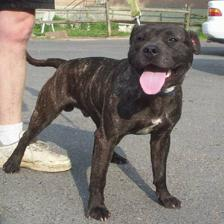

# TORCH-XRAY

Torchxray is a library to visualize kernels especially for the image processing models. It can be easily used with 
custom models. The only assumption is the layers desired to be inspected, are must be defined as attribute in custom 
`nn.Module` class. 


## Example Usage


###### Defining a custom model as usual
```
class ExampleNetwork(nn.Module):
	def __init__(self):
		super(ExampleNetwork, self).__init__()

		# Static Layers - **These static layers need to be defined here as attribute, else they can not be tracked**
		self.maxpool_std2 = nn.MaxPool2d(2, 2)
		self.flatten = nn.Flatten()             
		self.relu = nn.ReLU()                       
		self.dropout10 = nn.Dropout(p=0.1)
		self.dropout15 = nn.Dropout(p=0.15)
		self.dropout20 = nn.Dropout(p=0.2)

		# Conv Layers
		self.conv1 = nn.Conv2d(3, 8, 5)
		self.conv2 = nn.Conv2d(8, 16, 7) 
		self.conv3 = nn.Conv2d(16, 32, 5) 

		# Fully-Connected Layers
		self.linear1 = nn.Linear(18432, 4096)
		self.linear2 = nn.Linear(4096, 512)
		self.linear3 = nn.Linear(512, 2)

	def forward(self, x):
		x = self.relu(self.conv1(x))
		x = self.maxpool_std2(x)

		x = self.relu(self.conv2(x))
		x = self.maxpool_std2(x)

		x = self.relu(self.conv3(x))
		x = self.maxpool_std2(x)

		x = self.flatten(x)
		
		x = self.relu(self.linear1(x))
		x = self.dropout15(x)
		
		x = self.relu(self.linear2(x))
		x = self.linear3(x)

		return x
```

###### Initializing Xray
```
from torchxray import Xray

input_example = read_image('path_example_input').float()
input_example = input_example.resize(1, *(x.size())).to(device)
xray = Xray(model, input_tensor=input_example)
xray.initialize()
```


###### Training model
```
for epoch in range(10):  # loop over the dataset multiple times

    running_loss = 0.0
    for i, data in enumerate(trainloader, 0):
        model.train()
        # print('Epoch:', epoch, 'Batch:', i)
        # get the inputs; data is a list of [inputs, labels]
        inputs, labels = data
        inputs, labels = inputs.to(device), labels.to(device)

        # zero the parameter gradients
        optimizer.zero_grad()

        # forward + backward + optimize
        outputs = model(inputs)
        loss = loss_func(outputs, labels)

        output_labels = torch.argmax(outputs, 1)
        acc = ((output_labels == labels).sum() / len(labels)).item()
        accuracy_history.append(acc)

        loss.backward()
        optimizer.step()

        # print statistics
        loss_history.append(loss.item())
        running_loss += loss.item()
        report_interval = 50
        if i % report_interval == 0:
            # print(f'[{epoch + 1}, {i + 1:5d}] loss: {running_loss / report_interval:.3f} -- acc: ')
            
            # ** The only one line required to save/show plots  
            xray.take_graph(x, batch_num=epoch * len(trainloader) + i, show_plot=False, save_plot=True)
```


### Simple architecture plot drawn by xray
<p align="center">
  
</p>

## Outputs
###### Convolutional Kernel Weights
<p align="left">
  
  
  
</p>

###### Linear Kernel Weights
<p align="left">
  
  
  
</p>


### Example-1
[//]: # (![alt_text]&#40;./static/reference_image_cat.jpg&#41;)
<p align="left">
  
</p>

###### Convolutional layer's outputs
<p align="left">
  
  
  
</p>

### Example-2
<p align="left">
  
</p>

###### Convolutional layer's outputs
<p align="left">
  
  
  
</p>

